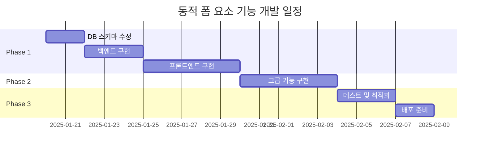

# 📋 Product Requirements Document (PRD)
## 동의서 템플릿 동적 폼 요소 기능

---

## 📌 Executive Summary

### 프로젝트명
동의서 템플릿 동적 폼 요소 관리 시스템

### 버전
v1.0.0

### 작성일
2025-01-XX

### 작성자
시스템 아키텍처팀

### 승인자
- [ ] Product Owner
- [ ] Tech Lead
- [ ] QA Lead

---

## 🎯 목적 및 배경

### 배경
현재 동의서 템플릿은 정적인 HTML 텍스트만 지원하여, 사용자의 선택이 필요한 동의 항목(라디오 버튼, 체크박스 등)을 동적으로 관리할 수 없는 한계가 있습니다.

### 목적
- 동의서 템플릿에 라디오 버튼, 체크박스 등의 동적 폼 요소를 추가할 수 있는 기능 제공
- 사용자가 제출한 동적 폼 데이터를 체계적으로 저장 및 관리
- 제출된 동의서의 동적 폼 응답을 효과적으로 조회 및 분석

### 기대 효과
- 다양한 형태의 동의서 작성 가능
- 동의 항목별 세분화된 데이터 수집
- 법적 요구사항에 대한 유연한 대응

---

## 🔍 요구사항 정의

### 기능 요구사항

#### FR-001: 동적 폼 요소 추가
- 관리자는 템플릿 편집 시 라디오 버튼 그룹을 추가할 수 있다
- 관리자는 템플릿 편집 시 체크박스를 추가할 수 있다
- 각 폼 요소는 고유한 이름(name)을 가져야 한다
- 폼 요소는 시각적으로 구분되어야 한다

#### FR-002: 메타데이터 관리
- 시스템은 동적 폼 요소의 메타데이터를 자동으로 추출해야 한다
- 메타데이터는 JSON 형식으로 저장되어야 한다
- 템플릿 수정 시 메타데이터가 자동 업데이트되어야 한다

#### FR-003: 데이터 수집 및 저장
- 사용자가 입력한 동적 폼 데이터를 수집할 수 있어야 한다
- 폼 데이터는 JSON 형식으로 저장되어야 한다
- 필수 필드 검증이 가능해야 한다

#### FR-004: 데이터 조회
- 관리자는 제출된 동의서의 동적 폼 응답을 조회할 수 있다
- Excel 내보내기 시 동적 폼 데이터가 포함되어야 한다
- 동적 폼 응답에 대한 통계를 제공해야 한다

### 비기능 요구사항

#### NFR-001: 성능
- 동적 폼 요소가 100개 이상 포함된 템플릿도 3초 이내 로딩
- JSON 쿼리 성능 최적화

#### NFR-002: 호환성
- 기존 템플릿과의 하위 호환성 보장
- 템플릿 수정 시 기존 제출 데이터 보존

#### NFR-003: 사용성
- 직관적인 UI/UX
- 드래그 앤 드롭 지원 (Phase 2)

---

## 🏗️ 시스템 설계

### 데이터베이스 스키마

#### 1. ConsentTemplate 테이블 수정
```sql
ALTER TABLE consent_template
ADD COLUMN form_schema JSON COMMENT '동적 폼 요소 메타데이터';

-- form_schema 구조 예시
{
  "version": "1.0",
  "fields": [
    {
      "name": "agreement",
      "type": "radio",
      "label": "개인정보 수집 동의",
      "options": ["동의", "비동의"],
      "required": true,
      "order": 1
    },
    {
      "name": "marketing",
      "type": "checkbox",
      "label": "마케팅 정보 수신",
      "options": ["이메일", "SMS", "앱 푸시"],
      "required": false,
      "order": 2
    }
  ]
}
```

#### 2. ConsentRecord 테이블 수정
```sql
ALTER TABLE consent_record
ADD COLUMN form_data JSON COMMENT '사용자가 입력한 동적 폼 데이터';

-- form_data 구조 예시
{
  "agreement": "동의",
  "marketing": ["이메일", "SMS"],
  "terms": true
}
```

### 시스템 아키텍처

```
┌─────────────────┐     ┌─────────────────┐     ┌─────────────────┐
│   Frontend      │────▶│   Backend       │────▶│   Database      │
│  (Thymeleaf)    │     │  (Spring Boot)  │     │   (MariaDB)     │
└─────────────────┘     └─────────────────┘     └─────────────────┘
        │                        │                        │
        ▼                        ▼                        ▼
  [폼 요소 추가]           [메타데이터 추출]         [JSON 저장]
  [데이터 수집]           [검증 로직]              [JSON 쿼리]
  [UI 렌더링]            [비즈니스 로직]          [인덱싱]
```

---

## 📝 상세 구현 계획

### Phase 1: 기본 기능 구현 (2주)

#### Week 1: 백엔드 구현
- [ ] 데이터베이스 스키마 수정
- [ ] Entity 클래스 업데이트
- [ ] Service 레이어 구현
- [ ] REST API 엔드포인트 개발

#### Week 2: 프론트엔드 구현
- [ ] 템플릿 편집기 UI 개선
- [ ] 동적 폼 요소 추가 기능
- [ ] 메타데이터 자동 추출 로직
- [ ] 동의서 작성 페이지 수정

### Phase 2: 고급 기능 (1주)

- [ ] 데이터 조회 및 상세보기
- [ ] Excel 내보내기 기능 확장
- [ ] 통계 대시보드 구현
- [ ] 필수 필드 검증 강화

### Phase 3: 최적화 및 테스트 (1주)

- [ ] 성능 최적화
- [ ] 단위 테스트 작성
- [ ] 통합 테스트
- [ ] 사용자 매뉴얼 작성

---

## 🔄 API 스펙

### 1. 템플릿 저장 API (수정)

**Endpoint:** `POST /api/admin/templates`

**Request Body:**
```json
{
  "title": "개인정보 수집 동의서",
  "content": "<div>...</div>",
  "form_schema": {
    "version": "1.0",
    "fields": [...]
  }
}
```

### 2. 동의서 제출 API (수정)

**Endpoint:** `POST /api/consent/submit`

**Request Body:**
```json
{
  "templateId": 1,
  "participantName": "홍길동",
  "phoneNumber": "010-1234-5678",
  "form_data": {
    "agreement": "동의",
    "marketing": ["이메일"]
  }
}
```

### 3. 동적 폼 데이터 조회 API

**Endpoint:** `GET /api/admin/consent/{id}/form-data`

**Response:**
```json
{
  "consentId": 123,
  "form_schema": {...},
  "form_data": {...},
  "submitted_at": "2025-01-15T10:30:00"
}
```

---

## 🎨 UI/UX 설계

### 템플릿 편집기
- 툴바에 "선택" (라디오), "체크" (체크박스) 버튼 추가
- 드래그 앤 드롭으로 위치 조정 (Phase 2)
- 실시간 미리보기

### 동의서 작성 페이지
- 동적 폼 요소 자동 렌더링
- 모바일 반응형 디자인
- 필수 항목 시각적 표시

### 관리자 상세보기
- 동적 폼 응답 테이블 형식 표시
- 응답별 색상 코딩
- 통계 요약 카드

---

## 📊 성공 지표 (KPI)

| 지표 | 목표 | 측정 방법 |
|------|------|-----------|
| 템플릿 생성 시간 | 50% 단축 | 사용자 테스트 |
| 데이터 정확도 | 99% 이상 | QA 검증 |
| 시스템 응답 시간 | 3초 이내 | 성능 테스트 |
| 사용자 만족도 | 4.5/5.0 | 설문 조사 |

---

## ⚠️ 리스크 관리

### 기술적 리스크
| 리스크 | 영향도 | 대응 방안 |
|--------|--------|-----------|
| JSON 쿼리 성능 저하 | 높음 | 인덱싱 및 캐싱 전략 |
| 브라우저 호환성 | 중간 | 폴리필 적용 |
| 데이터 마이그레이션 | 높음 | 단계적 롤아웃 |

### 비즈니스 리스크
| 리스크 | 영향도 | 대응 방안 |
|--------|--------|-----------|
| 사용자 학습 곡선 | 중간 | 튜토리얼 및 가이드 제공 |
| 법적 요구사항 변경 | 높음 | 유연한 스키마 설계 |

---

## 📅 일정 관리



---

## 🔍 검증 계획

### 단위 테스트
- Service 레이어 테스트
- JSON 파싱 로직 테스트
- 검증 로직 테스트

### 통합 테스트
- API 엔드포인트 테스트
- 데이터 저장/조회 플로우
- 엣지 케이스 처리

### 사용자 수용 테스트 (UAT)
- 실제 동의서 작성 시나리오
- 관리자 기능 검증
- 성능 및 응답성 테스트

---

## 📚 참고 문서

- [MariaDB JSON 데이터 타입 문서](https://mariadb.com/kb/en/json-data-type/)
- [Spring Boot JSON 처리 가이드](https://spring.io/guides)
- [Thymeleaf 폼 처리](https://www.thymeleaf.org/doc/tutorials/3.0/thymeleafspring.html)

---

## 🤝 이해관계자

| 역할 | 담당자 | 책임 |
|------|--------|------|
| Product Owner | TBD | 요구사항 정의, 우선순위 결정 |
| Tech Lead | TBD | 기술 설계, 코드 리뷰 |
| Backend Developer | TBD | 서버 로직 구현 |
| Frontend Developer | TBD | UI/UX 구현 |
| QA Engineer | TBD | 테스트 계획 및 실행 |
| DevOps | TBD | 배포 및 모니터링 |

---

## 📝 변경 이력

| 버전 | 날짜 | 작성자 | 변경 내용 |
|------|------|--------|-----------|
| 1.0.0 | 2025-01-XX | System | 초기 작성 |

---

## ✅ 승인

본 PRD 문서는 아래 이해관계자들의 검토와 승인을 거쳐 확정되었습니다.

| 승인자 | 직책 | 서명 | 날짜 |
|--------|------|------|------|
| | Product Owner | | |
| | Tech Lead | | |
| | QA Lead | | |

---

*이 문서는 프로젝트 진행 중 필요에 따라 업데이트될 수 있습니다.*